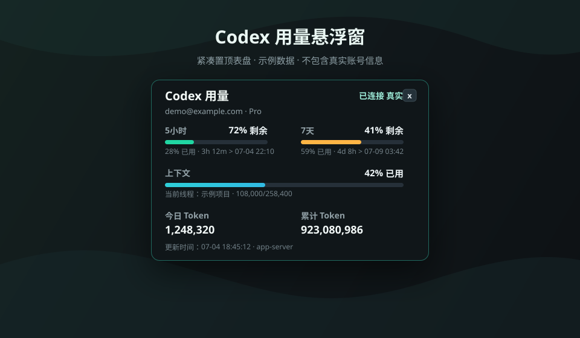

# Codex 用量悬浮窗

[](https://github.com/Justin-147/codex-usage-hud/releases)
[](README.md)
[](README.md)
[](README.md)
[](CHANGELOG.md)
一个 Windows 置顶中文悬浮窗，用 Codex app-server 和本地 session 记录读取真实数据。



> 上图使用匿名示例数据，实际运行时会读取本机 Codex 的真实用量和当前线程上下文。

## 启动

双击：

```bat
Start-CodexUsageHud.cmd
```

或在 PowerShell 中运行：

```powershell
powershell.exe -STA -NoProfile -ExecutionPolicy Bypass -File .\Start-CodexUsageHud.ps1
```

## 数据源

- `account/rateLimits/read`：主 Codex 额度窗口，包含 5 小时和 7 天用量比例、剩余重置时间、本地重置日期时间。
- `account/usage/read`：账号 token 活动摘要，包含累计 token 和每日 token。
- Codex Desktop 活动日志：识别当前点击/聚焦的线程；找不到焦点信号时退回最近更新线程。
- 本地 session JSONL 的 `token_count`：当前线程的真实 token/context 数据，使用 `last_token_usage / model_context_window` 显示上下文比例，并显示对应线程。
- `thread/tokenUsage/updated`：如果 app-server 连接收到线程 token/context 更新通知，也会即时刷新。

## 说明

窗口关闭时会自动关闭后台采集器。后台默认约 5 秒刷新一次，状态文件写在同目录的 `status.json`。悬浮窗会把拖动后的位置保存到 `hud-settings.json`，下次启动自动回到同一位置。

## 自动启动

双击 `Start-CodexUsageHud.cmd` 会隐藏/最小化启动终端，只保留悬浮窗。

如需在 Codex 启动时自动打开悬浮窗，先安装 watcher：

```powershell
powershell.exe -NoProfile -ExecutionPolicy Bypass -File .\Install-CodexUsageHudAutostart.ps1 -StartNow
```

该 watcher 会在 Windows 登录后隐藏运行，检测到 Codex 进程启动时自动启动悬浮窗。安装脚本会优先尝试计划任务；如果权限不足，会退回到用户“启动”文件夹快捷方式。卸载：

```powershell
powershell.exe -NoProfile -ExecutionPolicy Bypass -File .\Uninstall-CodexUsageHudAutostart.ps1
```
紧凑版表盘默认约 320 x 214 像素，5 小时和 7 天额度并排显示，上下文和 token 信息压缩为短行；完整线程名、重置时间等保留在悬停提示中。

## Release Status

当前版本是 `v0.1.0`，适合个人 Windows 环境试用。它不是 OpenAI 官方工具，也不是 Codex Desktop 的替代品。数据读取依赖本机 Codex app-server、本地活动日志和 session JSONL；如果 Codex 内部数据格式变化，可能需要同步更新。
## 功能

- Windows 置顶 HUD：以紧凑窗口展示 Codex 用量。
- 真实用量读取：通过 Codex app-server 和本地 session 数据读取额度、token 和 context。
- 当前线程识别：优先使用 Codex Desktop 活动日志识别当前焦点线程。
- 自动刷新：后台采集器默认约 5 秒刷新一次。
- 位置保存：拖动后会保存窗口位置，下次启动自动恢复。
- 自动启动 watcher：可在检测到 Codex 进程启动时自动打开悬浮窗。
- 中文界面：面向中文用户优化显示和说明。
## 安全与限制

- 本项目不是 OpenAI 官方项目。
- 不上传任何数据；读取和展示都在本机完成。
- 仅支持 Windows 桌面环境。
- 依赖 Codex 本机 app-server 和本地 session 文件。
- 如果 Codex 内部接口、日志路径或 session 格式变化，HUD 可能需要更新。
- 本工具只用于显示用量和上下文信息，不修改 Codex 数据。
